# 🏢 [Tech Deep Dive] 하이퍼스케일 클라우드를 움직이는 MEP 전문가: DCEO (Data Center Engineering Operations)

> 전 세계 수백만 기업과 생성형 AI 서비스가 의존하는 AWS 하이퍼스케일 클라우드의 이면에는, 메가와트(MW)급 전력과 초고밀도 열부하를 365일 24시간 단 1초의 중단 없이 완벽하게 제어하는 **MEP(Mechanical, Electrical, Plumbing) 엔지니어링 전문가 조직**이 존재합니다.  
> 바로 **AWS DCEO(Data Center Engineering Operations)** 팀입니다.  
> 본 아티클에서는 **AWS 공식 DCEO 채용 직무 기술서(Job Description)**와 국내외 현직자 인터뷰를 바탕으로, **DCEO의 핵심 미션과 10대 핵심 직무, 전력·기계·공조 상세 설비 스펙, MOP/SOP/EOP 운영 프레임워크, 그리고 포용적인 엔지니어링 문화와 워라밸**을 전문적인 관점에서 심층 분석합니다.

---

## 1. ⚡ AWS DCEO의 정의와 핵심 미션

**AWS DCEO(Data Center Engineering Operations)**는 데이터센터 건물의 **물리적·유틸리티 인프라(전력, 냉각, 공조, 방재, 환경 제어)의 구축, 운영, 최적화 및 무중단 유지보수(Concurrent Maintainability)**를 총괄하는 전문 엔지니어링 조직입니다.

  

    
⚡ Electrical Domain

    

      • 22.9kV / 13.2kV 특고압 수배전반 
      • 대용량 Standby 발전기 및 병렬 계통 
      • VFI Class Static / Rotary UPS 시스템 
      • ATS / STS / PDU / RPP 전력 분배
    

  

  

    
❄️ Mechanical & Thermal

    

      • 수랭식/공랭식 Chiller & Cooling Tower 
      • AI 초고밀도 랙 Direct-to-Chip 액체 냉각 
      • CRAH / CRAC / AHU 정밀 공조 시스템 
      • Hot/Cold Aisle 기류 차폐 및 PUE 최적화
    

  

  

    
🎛️ Controls & Safety

    

      • BMS / BAS 빌딩 자동제어 시스템 
      • EPMS 전력 품질 및 SCADA 실시간 감시 
      • VESDA 극초기 화재 감지 및 가스계 소화 
      • 급배수(Plumbing) 및 수처리 계통 제어
    

  

> [!IMPORTANT]
> **DCEO의 핵심 목표: 100% 가용성(Availability) 보장**  
> DCEO는 자체 데이터센터뿐만 아니라 **서드파티 코로케이션(Colocation) 시설** 내의 모든 전기, 기계 및 소방/안전 장비가 계약 조항(SLA)에 맞게 완벽히 가동되도록 벤더를 감독하고 위험을 사전에 통제(Risk Mitigation)합니다.

---

## 2. 📋 AWS DCEO의 10대 핵심 직무 (Key Job Responsibilities)

공식 직무 기술서에 명시된 DCEO 엔지니어의 핵심 업무 영역은 시설 유지보수를 넘어 인프라 엔지니어링과 프로젝트 관리를 아우릅니다.

1. **미션 크리티컬 설비 운영 및 비상 대응 (Critical Facility Operations)**
   - 스위치기어, 변압기, 발전기, UPS, 칠러, 냉각탑, CRAH 등 필수 설비의 상시 기동 및 비상 장애 복구 총괄.
2. **현장 벤더 및 서브컨트랙터 관리 (Vendor & Shift Management)**
   - 교대 근무 테크니션(Shift Technicians)과 외부 전문 유지보수 업체의 모든 현장 작업이 표준 절차서에 따라 안전하게 진행되도록 현장 지휘.
3. **서드파티 코로케이션(Colocation) 제공업체 관리**
   - 상면 제공 파트너사의 엔지니어링 팀과 긴밀히 협력하여 계약 스펙 및 전력/공조 SLA 준수 여부 상시 검증.
4. **성능 벤치마크 분석 및 메트릭 리포팅 (Metrics & Performance Analysis)**
   - 전력 사용 효율(PUE), 물 사용 효율(WUE), 장비 가동률 등 주요 운영 지표를 주기적으로 분석하고 개선 보고서 작성.
5. **데이터센터 용량 계획 (Capacity Planning)**
   - 신규 서버 랙 및 초고밀도 AI 클러스터 증설에 대비하여 전기 용량(MW), 냉각 부하(kW), 물리적 공간을 사전에 시뮬레이션 및 배분.
6. **신규 데이터센터 설계 및 건축 참여 (New Facility Design & Build-out)**
   - 신규 데이터센터의 커미셔닝(Commissioning) 단계에서 도면 검토, 설비 시운전 및 무정전 부하 테스트에 직접 참여.
7. **기존 설비 에너지 효율화 프로젝트 (Efficiency Optimization)**
   - 외기 냉방(Free Cooling) 도입, 냉각수 온도 튜닝, 인버터 제어 등을 통한 전력 소비 절감 프로젝트 주도.
8. **IT 리더십과의 다각적 프로젝트 협력**
   - IT 시스템 매니저, 네트워크 팀과 긴밀히 공조하여 플랜트 안전성과 신뢰성을 극대화하는 종합 엔지니어링 조율.
9. **DCEO 관련 구매 및 예산 집행 (Procurement Management)**
   - 주요 예비 부품(Critical Spares), 필터, 소모품 및 엔지니어링 외주 용역에 대한 구매 및 조달 프로세스 운영.
10. **자산 및 예비품 재고 관리 (Asset & Inventory Management)**
    - 고가의 전력/기계 부품 및 계측 장비의 라이프사이클을 추적하고 결품 없는 비상 재고(Safety Stock) 유지.

---

## 3. 🔬 심층 설비 스펙 및 엔지니어링 기술 스택

글로벌 AWS DCEO 엔지니어가 실무에서 다루는 전력·기계·공조 및 제어 기술의 주요 대표 예시입니다.

```mermaid
graph TD
    subgraph Electrical ["⚡ Electrical Power Train (전력 공급망)"]
        Grid["한전 특고압 수전 (22.9kV)"] --> MV["MV Switchgear & 변압기"]
        Gen["Standby 디젤 발전기"] --> Paralleling["병렬 운전반 (Paralleling Gear)"]
        Paralleling --> ATS["자동 절체 스위치 (ATS)"]
        MV --> UPS["VFI Class Static / Rotary UPS"]
        ATS --> UPS
        UPS --> STS["정지형 절체 스위치 (STS)"]
        STS --> PDU["전력 분배 장치 (PDU / RPP)"]
        PDU --> Rack["IT 서버 랙 (Server Rack)"]
    end

    subgraph Cooling ["❄️ Cooling & Thermal Loop (냉각 계통)"]
        Tower["냉각탑 (Cooling Tower)"] --> Chiller["고효율 칠러 플랜트"]
        Chiller --> HeatEx["판형 열교환기 (Free Cooling)"]
        HeatEx --> CRAH["정밀 공조기 (CRAH / AHU)"]
        HeatEx --> CDU["액체냉각 분배장치 (CDU)"]
        CDU --> DirectLiquid["AI GPU Direct-to-Chip 냉각"]
        CRAH --> Containment["Hot / Cold Aisle 차폐"]
    end
```

### ⚡ 1) Electrical Engineering (전력 계통)
- **수배전 설비**: Utility Substation Feeds, 특고압 변압기(Transformers), 중·저압 스위치기어(Switchgear).
- **무정전 전원(UPS) & 배터리**: VFI(Voltage and Frequency Independent) Class UPS, Dynamic Rotary UPS(DRUPS), 리튬이온(Li-ion) 및 VRLA 배터리 뱅크, 배터리 모니터링 시스템(BMS).
- **발전기 계통**: 대용량 디젤 및 가스 터빈 발전기, 연료 공급 및 이송 루프, 자동 동기화 병렬 운전반(Paralleling Switchgear).
- **전력 분배 및 품질 관리**: ATS, 고속 정지형 절체 스위치(STS), PDU/RPP, 서지 억제기(TVSS), 능동형 고조파 필터(Active Harmonic Filtering), 분기 회로 모니터링(BCMS), 전력 감시 SCADA.
- **안전 표준**: 아크 플래시(Arc Flash) 위험성 분석, NFPA 70E 안전 지침 및 LOTO(Lockout/Tagout) 절차 준수.

### ❄️ 2) Mechanical & Plumbing Engineering (기계·냉각·배관 계통)
- **중앙 냉각 플랜트**: 원심식 및 마그네틱 베어링 칠러, 냉각탑(Cooling Tower), 대용량 축냉 탱크(Thermal Storage Tanks), 판형 열교환기(Plate Heat Exchangers).
- **공조 및 기류 제어**: CRAC / CRAH / AHU 정밀 공조기, 가변 풍량 팬(VFD), 댐퍼 및 덕트 계통, Hot/Cold Aisle 차폐(Containment).
- **차세대 액체 냉각(Liquid Cooling)**: 고발열 AI 가속기 랙을 위한 냉각수 분배 장치(CDU), 2차 냉각 루프 및 Direct-to-Chip 수랭 블록.
- **수처리 및 배관 계통**: 화학적 수처리 시스템(Chemical Water Treatment), 냉각수 펌프, 전동 밸브(Actuator Valves), 급배수 및 오폐수 계통.
- **소방 및 안전 (Fire / Life Safety)**: 극초기 공기 흡입 감지 시스템(VESDA), 프리액션 스프링클러(Pre-action), 친환경 가스계 소화 설비, 방화 댐퍼.

### 🎛️ 3) 자동화 제어 및 모니터링 (Controls & Automation)
- **빌딩 자동제어(BMS/BAS)**: DDC/PLC 컨트롤러 기반 24/365 실시간 밸브 개도율, 팬 속도, 차압, 온습도 자동 제어.
- **도면 해석(Drawing Literacy)**: 전기 단선도(Single Line Diagram, SLD), 배관 계장도(P&ID), 시퀀스 제어 다이어그램(Sequence of Operations) 완벽 독해.

---

## 4. 🛡️ DCEO 3대 표준 운영 절차서 (MOP / SOP / EOP)

AWS DCEO의 안정성은 철저한 엔지니어링 규율(Operational Rigor)을 바탕으로 한 3대 표준 절차서에서 비롯됩니다.

  

    
📋 MOP (Method of Procedure) - 유지보수 실행 계획서

    

      운영 중인 설비 점검 및 부품 교체 시 작성하는 수십 페이지 분량의 초정밀 작업 지침서입니다. 밸브 1개를 돌리고 차단기 1개를 내리는 모든 동작의 전후 영향 평가, 위험 완화 방안, 그리고 유사시 100% 원상 복구하는 롤백(Rollback) 절차가 상세히 기록되며 다단계 상호 검토(Peer Review) 후 2인 1조로 실행됩니다.
    

  

  

    
📘 SOP (Standard Operating Procedure) - 표준 운영 절차서

    

      일상적인 설비 기동/정지, 필터 교체, 정기 패트롤 및 측정 작업에 대한 표준화된 매뉴얼입니다. 모든 근무자가 동일한 높은 기준(Highest Standards)으로 균일한 품질의 운영을 수행할 수 있도록 표준을 정의합니다.
    

  

  

    
🚨 EOP (Emergency Operating Procedure) - 비상 대응 절차서

    

      외부 전력망 차단, 냉수 배관 파손, 화재 경보 등 예기치 못한 위기 상황 발생 시 즉각 실행하는 비상 조치 매뉴얼입니다. 정기적인 비상 모의 훈련(Drill)을 통해 실제 상황에서도 당황하지 않고 조건반사적으로 대응할 수 있도록 체화합니다.
    

  

---

## 5. 🤝 포용적 팀 문화, 워라밸 및 글로벌 멘토링

AWS 데이터센터 조직은 최고 수준의 기술력과 더불어 직원들의 지속 가능한 성장과 삶의 균형을 중시합니다.

- **포용적인 팀 문화 (Inclusive Team Culture & ID&E)**: 다양한 배경(전기/기계/해양플랜트/발전소/반도체 팹 등)을 가진 인재들이 모여 서로의 관점을 존중하고 자유롭게 혁신적인 아이디어를 제안합니다.
- **실수를 통해 배우는 문화 & Kaizen(카이젠)**: 실패를 숨기지 않고 5-Why 원인 분석(COE)을 통해 시스템을 보강하며, 누구나 자율적으로 운영 개선 프로젝트(Kaizen)를 주도할 수 있습니다.
- **확실한 워라밸 (Work-Life Harmony)**: 24/7 교대 근무이지만 예측 가능한 규칙적인 교대 사이클과 충분한 휴식 기간이 보장됩니다. 특히 **퇴근 후에는 비상 알람이 현장 근무자에게만 전달**되어 완벽한 오프 듀티(Off-duty) 여가를 보장합니다.
- **글로벌 멘토링 및 성장 지원**: 1:1 매니저 면담(Growth Conversation), 전담 DCEO 트레이닝 프로그램, 글로벌 기술 자격증(CDCP, CDCS, PE, PMP, LEED 등) 취득 지원 및 해외 데이터센터 방문 기회가 제공됩니다.

---

## 6. 🔗 공식 참고 자료 및 현직자 인터뷰 원문

DCEO 팀의 생생한 현장 이야기와 직무 인터뷰, 워라밸 및 채용 정보는 아래 공식 링크를 통해 더 자세히 확인하실 수 있습니다.

<!-- LINK PREVIEW CARD 1 -->

  <a href="https://blog.naver.com/aws_culture/223774187556" target="_blank" style="text-decoration: none; display: flex; flex-wrap: wrap; color: inherit;">
    

      

        

          AWS Korea Blog
          현직자 인터뷰
        

        

          AWS DCEO 팀의 하루가 궁금해요! (Site Lead 나현 님 인터뷰)
        

        

          기계공학 전공자가 클라우드 DC에 합류한 계기, 24시간 무중단 비상 대응 체계, 글로벌 엔지니어 협업 및 레슨런 문화에 대한 생생한 인터뷰를 확인하세요.
        

      

      

        🔗 blog.naver.com/aws_culture/223774187556 원문 바로가기 →
      

    

  </a>

<!-- LINK PREVIEW CARD 2 -->

  <a href="https://blog.naver.com/aws_culture/224283295006" target="_blank" style="text-decoration: none; display: flex; flex-wrap: wrap; color: inherit;">
    

      

        

          JoCoding X AWS #1
          테크 콜라보 인터뷰 1편
        

        

          조코딩이 만난 AWS 데이터 센터 현직자들의 리얼 토크 (DCEO 문상현 님 외)
        

        

          DCEO 트레이닝 프로그램을 통한 엔지니어 육성, 설비 비상 모의 훈련(Drill) 체계, 글로벌 엔지니어링 협업 이야기.
        

      

      

        🔗 blog.naver.com/aws_culture/224283295006 원문 바로가기 →
      

    

  </a>

<!-- LINK PREVIEW CARD 3 -->

  <a href="https://blog.naver.com/aws_culture/223848412951" target="_blank" style="text-decoration: none; display: flex; flex-wrap: wrap; color: inherit;">
    

      

        

          JoCoding X AWS #2
          테크 콜라보 인터뷰 2편
        

        

          AWS 데이터센터 현직자들이 말하는 워라밸, 채용 꿀팁, 카이젠(Kaizen) 문화
        

        

          DCEO 전소현 님이 전하는 무중단 리던던시(이중화), 교대 근무 워라밸, 기술 및 LP 면접 팁과 글로벌 커리어 기회.
        

      

      

        🔗 blog.naver.com/aws_culture/223848412951 원문 바로가기 →
      

    

  </a>

<!-- LINK PREVIEW CARD 4 -->

  <a href="https://www.linkedin.com/feed/update/urn:li:activity:7476003575723216898/" target="_blank" style="text-decoration: none; display: flex; flex-wrap: wrap; color: inherit;">
    

      

        

          LinkedIn
          채용 & 네트워킹
        

        

          AWS Data Center 커리어 및 오프라인 네트워킹 이벤트 소식
        

        

          AWS 데이터센터 현직자들과 직접 만나 클라우드 인프라 운영 과정과 AI 시대의 인프라 변화, 커리어 성장 기회를 나눌 수 있는 공식 소식입니다.
        

      

      

        🔗 LinkedIn 공식 포스팅 바로가기 →
      

    

  </a>

---

## 7. 💡 요약: 클라우드 인프라의 물리적 심장을 책임지는 자부심

AWS DCEO 팀은 단순히 고장 난 설비를 고치는 유지보수자가 아닙니다. 메가와트급 특고압 전력망과 최첨단 액체 냉각 플랜트, 그리고 복잡한 BMS 자동제어 시스템을 총괄하여 **전 세계 클라우드와 생성형 AI 가속기의 가동 시간을 물리적으로 결정짓는 최고의 MEP InfraOps 엔지니어링 전문가 집단**입니다.  
철저한 MOP 기반 운영 규율과 포용적인 조직 문화 속에서, 자신의 물리적 판단과 노하우가 글로벌 하이퍼스케일 인프라의 표준이 되는 특별한 경험을 누릴 수 있는 가장 매력적인 분야입니다.
