# 🏢 [Tech Deep Dive] 하이퍼스케일 클라우드를 움직이는 MEP InfraOps 전문가: AWS DCEO 심층 분석

> 전 세계 수백만 기업과 AI 서비스가 의존하는 AWS 하이퍼스케일 데이터센터의 이면에는, 메가와트(MW)급 전력과 초고밀도 열부하를 365일 24시간 단 1초의 중단 없이 완벽하게 제어하는 **MEP(Mechanical, Electrical, Plumbing) 엔지니어링 전문가 조직**이 존재합니다.  
> 바로 **AWS DCEO(Data Center Engineering Operations)** 팀입니다.  
> 본 아티클에서는 글로벌 AWS DCEO Job Posting과 국내외 현직자 인터뷰를 바탕으로, **DCEO의 핵심 미션, MEP 도메인별 심층 설비 기술, MOP/SOP/EOP 운영 프레임워크, 그리고 글로벌 채용 스펙 및 엔지니어링 문화**를 전문적인 관점에서 심층 분석합니다.

---

## 1. ⚡ AWS DCEO의 정의와 핵심 미션

**AWS DCEO(Data Center Engineering Operations)**는 데이터센터 건물의 **물리적·유틸리티 인프라(전력, 냉각, 공조, 방재, 환경 제어)의 구축, 운영, 최적화 및 무중단 유지보수(Concurrent Maintainability)**를 총괄하는 전문 엔지니어링 조직입니다.

```
┌──────────────────────────────────────────────────────────────────────────────┐
│                  AWS Hyper-scale Critical Infrastructure Architecture        │
├──────────────────────────────┬───────────────────────────────┬───────────────┤
│    ⚡ Electrical Domain      │    ❄️ Mechanical & Thermal     │  🎛️ Controls  │
│   • 22.9kV/13.2kV 특고압 수배전 │   • 수랭식/공랭식 Chiller & Cooling │  • BMS / BAS  │
│   • 대용량 Standby 발전기 & 병렬  │   • Direct-to-Chip CDU 액체 냉각   │  • EPMS 전력  │
│   • Static/Rotary UPS 배터리계통 │   • CRAH / AHU 정밀 공조 시스템    │  • SCADA/PLC  │
│   • ATS / STS / PDU / RPP    │   • Hot/Cold Aisle 기류 차폐      │  • 텔레메트리 │
└──────────────────────────────┴───────────────────────────────┴───────────────┘
```

### 🎯 DCEO의 3대 핵심 KPI
1. **100% 무중단 가용성 (High Availability & Zero Downtime)**: 단일 장비 결함이나 외부 전력망 이상 시에도 $N+1$ 또는 $2N$ 리던던시를 통해 서버 전원과 냉각 루프를 0.001초의 깜빡임 없이 유지.
2. **에너지 효율화 (PUE & WUE Optimization)**: 칠러 가변 운전, 외기 냉방(Free Cooling), 액체 냉각(Direct Liquid Cooling) 도입을 통해 세계 최저 수준의 PUE(전력효율지수) 달성.
3. **운영 무결성 (Operational Excellence)**: 철저한 표준 절차서(MOP/SOP/EOP) 준수 및 글로벌 사고 분석(COE)을 통한 인적·물리적 리스크 원천 제거.

---

## 2. 🔬 DCEO가 다루는 3대 MEP 핵심 도메인 심층 분석

AWS 글로벌 DCEO 엔지니어들은 데이터센터 내의 거대한 MEP 설비를 직접 운영하고 감시합니다.

```mermaid
graph TD
    subgraph Electrical ["⚡ Electrical System (전력 계통)"]
        Grid["한전/외부 전력망 (22.9kV/154kV)"] --> MV["특고압 수배전반 (MV Switchgear)"]
        Gen["비상 디젤 발전기 (Standby Generator)"] --> ATS["자동 절체기 (ATS/Paralleling Gear)"]
        MV --> XFRM["변압기 (Transformer)"]
        XFRM --> UPS["무정전 전원장치 (Static/Rotary UPS)"]
        ATS --> UPS
        UPS --> STS["정지형 절체 스위치 (STS)"]
        STS --> PDU["전력 분배 장치 (PDU/RPP)"]
        PDU --> IT["IT Server Rack"]
    end

    subgraph Mechanical ["❄️ Mechanical & Cooling (냉각 계통)"]
        Tower["냉각탑 (Cooling Tower)"] --> Chiller["칠러 (Centrifugal/Mag-bearing Chiller)"]
        Chiller --> PrimaryLoop["1차 냉수 루프 (Chilled Water Loop)"]
        PrimaryLoop --> CRAH["컴퓨터실 공조기 (CRAH/AHU)"]
        PrimaryLoop --> CDU["냉각 분배 장치 (Coolant Distribution Unit)"]
        CDU --> DirectLiquid["AI/GPU 칩 직접 액체 냉각 (Direct-to-Chip)"]
        CRAH --> Aisle["Hot/Cold Aisle 차폐 기류 제어"]
    end
```



### 1) ⚡ 전력 엔지니어링 (Electrical Engineering)
- **특고압 수배전반 (MV Switchgear & Transformers)**: 수십 MW 용량의 특고압 수전을 저압(480V/415V/208V)으로 안전하게 변환 및 분배.
- **무정전 전원 공급 장치 (UPS System)**: 리튬이온(Li-ion) 및 VRLA 배터리 뱅크를 통해 정전 시 발전기 가동까지의 전력 공백을 0초로 방어.
- **비상 발전기 및 병렬 운전 (Generators & Paralleling Switchgear)**: 대용량 디젤 발전기 자동 시동, 동기화 병렬 투입, 연료 이송 계통 상시 모니터링.
- **전력 분배 및 절체 (ATS, STS, PDU)**: 고속 정지형 절체 스위치(STS)를 통해 전원 소스 A/B 간 무단락 전환 보장.
- **전기 안전 규격**: 아크 플래시(Arc Flash) 방호, NFPA 70E 안전 지침 및 LOTO(Lockout/Tagout) 엄격 준수.

### 2) ❄️ 기계·열유체 및 공조 냉각 (Mechanical & Thermal Engineering)
- **중앙 냉수 플랜트 (Chilled Water Plant)**: 고효율 마그네틱 베어링 칠러, 인버터 냉각수 펌프, 열교환기(Plate Heat Exchanger)를 통한 프리쿨링(Free Cooling) 극대화.
- **정밀 공조 시스템 (CRAH / AHU)**: 전산실 내부의 온도, 습도, 양압(Positive Pressure)을 ASHRAE TC 9.9 가이드라인에 맞춰 정밀 제어.
- **고밀도 액체 냉각 (Direct-to-Chip & CDU)**: 차세대 AI/GPU 고발열 랙(100kW+ per Rack) 대응을 위한 2차 냉각수 분배 장치(CDU) 및 블라인드 메이트(Blind-mate) 퀵 커플링 제어.
- **기류 차폐 (Aisle Containment)**: 차가운 공기와 뜨거운 배기를 물리적으로 격리하여 냉각 효율 극대화.

### 3) 🎛️ 감시 제어 및 자동화 (Controls & Automation)
- **EPMS (Electrical Power Monitoring System)**: 전력 품질(고조파, 역률, 전압 강하), 실시간 MW 소비량 및 피크 로드 감시.
- **BMS/BAS (Building Management/Automation System)**: PLC 기반 센서 텔레메트리를 통해 밸브 개도율, 팬 속도(VFD), 차압, 온습도를 24/365 실시간 자동 제어.
- **방재 및 소방 (Fire Protection & Life Safety)**: VESDA(극초기 공기 흡입형 감지기), 프리액션 스프링클러(Pre-action), 친환경 가스계 소화 설비 운영.

---

## 3. 🛡️ DCEO의 독보적인 글로벌 운영 프레임워크 (InfraOps Rigor)

AWS DCEO의 안정성은 단순히 좋은 장비에서 나오는 것이 아니라, **나노 단위로 체계화된 운영 절차서와 엔지니어링 규율(Operational Rigor)**에서 비롯됩니다.

```
┌────────────────────────────────────────────────────────────────────────┐
│                        DCEO 3대 표준 운영 절차서                      │
├────────────────────────────────────────────────────────────────────────┤
│ 📋 MOP (Method of Procedure)                                           │
│   • 설비 유지보수·점검 시 작성하는 수십 페이지의 단계별 실행 계획서    │
│   • 밸브 1개 회전, 차단기 1개 조작까지 위험 분석 및 원복 절차(Rollback) 명시 │
│                                                                        │
│ 📘 SOP (Standard Operating Procedure)                                  │
│   • 일상적인 설비 기동/정지, 필터 교체, 정기 점검에 대한 표준 매뉴얼   │
│                                                                        │
│ 🚨 EOP (Emergency Operating Procedure)                                 │
│   • 전력망 차단, 냉수관 파손 등 비상 상황 발생 시 즉각 실행하는 대응 지침 │
│   • 정기 모의 훈련(Drill)을 통해 모든 엔지니어가 무의식적으로 행동 체화│
└────────────────────────────────────────────────────────────────────────┘
```

### 1) MOP 기반의 무중단 설비 유지보수
- 운영 중인 데이터센터에서 변압기 점검이나 칠러 오버홀을 수행할 때, **MOP(Method of Procedure)**를 사전에 다단계로 상호 검토(Peer Review)하고 승인받은 후 2인 1조(Two-person Rule)로 오차 없이 실행합니다.

### 2) 장애 분석 및 글로벌 레슨런: COE (Correction of Errors)
- 만약 설비 이상이 발생하면, 단순히 복구하는 데 그치지 않고 **5-Why 분석 기법**을 통해 근본 원인을 파악합니다.
- 작성된 **COE 보고서**는 전 세계 AWS 데이터센터 엔지니어링 조직에 즉시 공유되어, 타 리전 동일 장비의 잠재 위험을 사전에 차단하는 글로벌 모범 사례로 활용됩니다.

### 3) 24/7 교대 근무와 확실한 오프 듀티(Off-duty) 워라밸
- 24시간 무중단 체계이지만, 예측 가능한 규칙적인 교대 패턴과 체계적인 인계인수(Handover)를 통해 **퇴근 후에는 비상 알람이 근무자에게만 전달**되며 개인 시간을 온전히 보장받습니다.

---

## 4. 🌐 글로벌 AWS DCEO 채용 스펙 & 엔지니어링 커리어 패스

글로벌 AWS Job Posting(DCEO Technician, Data Center Chief Engineer, Facility Operations Lead)을 분석한 핵심 자격 요건 및 커리어 구조는 다음과 같습니다.

### 📋 주요 요구 역량 및 배경 (Target Backgrounds)
- **전공 및 산업군**: 전기공학, 기계공학, 해양플랜트/기관사(Marine Engineer), 원자력/발전소(Power Plant), 반도체/디스플레이 팹(FAB), 병원/초고층 빌딩 중앙설비실 출신.
- **도면 해석 능력**: 전기 단선도(Single Line Diagram, SLD), 배관 계장도(P&ID), 시퀀스 제어 다이어그램(Sequence of Operations) 독해 능력 필수.
- **글로벌 커뮤니케이션**: 해외 지사 엔지니어와의 기술 협업 및 인트라넷 기술 문서 공유를 위한 비즈니스 영어 역량.

### 🧠 DCEO 엔지니어에게 요구되는 아마존 리더십 원칙 (LP)
- **Ownership (주인 의식)**: 내가 담당하는 전력·냉각 밸브 하나가 글로벌 고객의 가용성에 직결된다는 책임감.
- **Dive Deep (깊게 파고들기)**: 이상 징후 발생 시 현장 데이터와 센서 로그를 끝까지 추적해 근본 원인 규명.
- **Insist on the Highest Standards (최고 수준 추구)**: 사소한 절차 하나도 타협하지 않고 완벽한 안전과 무결성 준수.

---

## 5. 🔗 공식 참고 자료 및 현직자 인터뷰 원문

AWS DCEO 팀의 생생한 현장 업무와 인터뷰 원문은 아래 공식 링크를 통해 확인하실 수 있습니다.

## 5. 🔗 공식 참고 자료 및 글로벌 레퍼런스

### 🌐 AWS 글로벌 공식 인프라 & 엔지니어링 레퍼런스

<!-- GLOBAL LINK PREVIEW CARD 1 -->
<div style="margin: 20px 0; border: 1px solid #E2E8F0; border-radius: 12px; overflow: hidden; background: #FFFFFF; box-shadow: 0 4px 14px rgba(0,0,0,0.05); transition: transform 0.2s, box-shadow 0.2s;">
  <a href="https://aws.amazon.com/about-aws/global-infrastructure/" target="_blank" style="text-decoration: none; display: flex; flex-wrap: wrap; color: inherit;">
    <div style="flex: 1 1 300px; padding: 18px 22px; display: flex; flex-direction: column; justify-content: space-between;">
      <div>
        <div style="display: flex; align-items: center; gap: 6px; margin-bottom: 6px;">
          <span style="background: #232F3E; color: #FF9900; font-size: 11px; font-weight: 800; padding: 2px 8px; border-radius: 4px;">AWS Global</span>
          <span style="font-size: 12px; color: #64748B;">인프라 아키텍처</span>
        </div>
        <div style="font-size: 16px; font-weight: 800; color: #0F172A; line-height: 1.4; margin-bottom: 6px;">
          AWS Global Infrastructure Architecture & Availability Zones
        </div>
        <div style="font-size: 13px; color: #475569; line-height: 1.5; margin-bottom: 10px;">
          전 세계 33개 이상의 리전과 100개 이상의 가용 영역(AZ)을 지탱하는 AWS 데이터센터의 물리적 이중화, 독립 전력망, 내진 및 방재 인프라 공식 설계 가이드입니다.
        </div>
      </div>
      <div style="font-size: 12px; color: #0284C7; font-weight: 700; display: flex; align-items: center; gap: 4px;">
        🔗 aws.amazon.com/about-aws/global-infrastructure 원문 바로가기 →
      </div>
    </div>
  </a>
</div>

<!-- GLOBAL LINK PREVIEW CARD 2 -->
<div style="margin: 20px 0; border: 1px solid #E2E8F0; border-radius: 12px; overflow: hidden; background: #FFFFFF; box-shadow: 0 4px 14px rgba(0,0,0,0.05); transition: transform 0.2s, box-shadow 0.2s;">
  <a href="https://sustainability.aboutamazon.com/products-services/aws-cloud" target="_blank" style="text-decoration: none; display: flex; flex-wrap: wrap; color: inherit;">
    <div style="flex: 1 1 300px; padding: 18px 22px; display: flex; flex-direction: column; justify-content: space-between;">
      <div>
        <div style="display: flex; align-items: center; gap: 6px; margin-bottom: 6px;">
          <span style="background: #059669; color: #FFFFFF; font-size: 11px; font-weight: 800; padding: 2px 8px; border-radius: 4px;">Amazon Sustainability</span>
          <span style="font-size: 12px; color: #64748B;">지속가능성 & PUE</span>
        </div>
        <div style="font-size: 16px; font-weight: 800; color: #0F172A; line-height: 1.4; margin-bottom: 6px;">
          AWS Cloud Data Center Sustainability & Water-Positive Engineering
        </div>
        <div style="font-size: 13px; color: #475569; line-height: 1.5; margin-bottom: 10px;">
          100% 재생 에너지 전환, 혁신적인 외기 냉방(Direct Evaporative Cooling), 폐수 재활용 및 데이터센터 탄소 발자국 감축 엔지니어링 공식 리포트입니다.
        </div>
      </div>
      <div style="font-size: 12px; color: #0284C7; font-weight: 700; display: flex; align-items: center; gap: 4px;">
        🔗 sustainability.aboutamazon.com/products-services/aws-cloud 원문 바로가기 →
      </div>
    </div>
  </a>
</div>

<!-- GLOBAL LINK PREVIEW CARD 3 -->
<div style="margin: 20px 0; border: 1px solid #E2E8F0; border-radius: 12px; overflow: hidden; background: #FFFFFF; box-shadow: 0 4px 14px rgba(0,0,0,0.05); transition: transform 0.2s, box-shadow 0.2s;">
  <a href="https://www.amazon.jobs/en/job_categories/operations-it-data-center-support" target="_blank" style="text-decoration: none; display: flex; flex-wrap: wrap; color: inherit;">
    <div style="flex: 1 1 300px; padding: 18px 22px; display: flex; flex-direction: column; justify-content: space-between;">
      <div>
        <div style="display: flex; align-items: center; gap: 6px; margin-bottom: 6px;">
          <span style="background: #D97706; color: #FFFFFF; font-size: 11px; font-weight: 800; padding: 2px 8px; border-radius: 4px;">Amazon Jobs</span>
          <span style="font-size: 12px; color: #64748B;">글로벌 DCEO 채용</span>
        </div>
        <div style="font-size: 16px; font-weight: 800; color: #0F172A; line-height: 1.4; margin-bottom: 6px;">
          Global AWS Data Center Engineering Operations (DCEO) Career Portal
        </div>
        <div style="font-size: 13px; color: #475569; line-height: 1.5; margin-bottom: 10px;">
          미국 버지니아, 유럽, 아시아 등 글로벌 전역의 AWS DCEO Chief Engineer, Facility Operations Manager 및 DCOT 엔지니어 공식 채용 공고와 상세 직무 기술서입니다.
        </div>
      </div>
      <div style="font-size: 12px; color: #0284C7; font-weight: 700; display: flex; align-items: center; gap: 4px;">
        🔗 amazon.jobs/.../operations-it-data-center-support 채용 포털 바로가기 →
      </div>
    </div>
  </a>
</div>

---

### 🇰🇷 AWS Korea 현직자 인터뷰 & 컬처 스토리

<!-- LINK PREVIEW CARD 1 -->
<div style="margin: 20px 0; border: 1px solid #E2E8F0; border-radius: 12px; overflow: hidden; background: #FFFFFF; box-shadow: 0 4px 14px rgba(0,0,0,0.05); transition: transform 0.2s, box-shadow 0.2s;">
  <a href="https://blog.naver.com/aws_culture/223774187556" target="_blank" style="text-decoration: none; display: flex; flex-wrap: wrap; color: inherit;">
    <div style="flex: 1 1 300px; padding: 18px 22px; display: flex; flex-direction: column; justify-content: space-between;">
      <div>
        <div style="display: flex; align-items: center; gap: 6px; margin-bottom: 6px;">
          <span style="background: #FF9900; color: #FFFFFF; font-size: 11px; font-weight: 800; padding: 2px 8px; border-radius: 4px;">AWS Korea Blog</span>
          <span style="font-size: 12px; color: #64748B;">현직자 인터뷰</span>
        </div>
        <div style="font-size: 16px; font-weight: 800; color: #0F172A; line-height: 1.4; margin-bottom: 6px;">
          AWS DCEO 팀의 하루가 궁금해요! (Site Lead 나현 님 인터뷰)
        </div>
        <div style="font-size: 13px; color: #475569; line-height: 1.5; margin-bottom: 10px;">
          기계공학 전공자가 클라우드 DC에 합류한 계기, 24시간 무중단 비상 대응 체계, 글로벌 엔지니어 협업 및 레슨런 문화에 대한 생생한 인터뷰를 확인하세요.
        </div>
      </div>
      <div style="font-size: 12px; color: #0284C7; font-weight: 700; display: flex; align-items: center; gap: 4px;">
        🔗 blog.naver.com/aws_culture/223774187556 원문 바로가기 →
      </div>
    </div>
  </a>
</div>

<!-- LINK PREVIEW CARD 2 -->
<div style="margin: 20px 0; border: 1px solid #E2E8F0; border-radius: 12px; overflow: hidden; background: #FFFFFF; box-shadow: 0 4px 14px rgba(0,0,0,0.05); transition: transform 0.2s, box-shadow 0.2s;">
  <a href="https://blog.naver.com/aws_culture/224283295006" target="_blank" style="text-decoration: none; display: flex; flex-wrap: wrap; color: inherit;">
    <div style="flex: 1 1 300px; padding: 18px 22px; display: flex; flex-direction: column; justify-content: space-between;">
      <div>
        <div style="display: flex; align-items: center; gap: 6px; margin-bottom: 6px;">
          <span style="background: #2563EB; color: #FFFFFF; font-size: 11px; font-weight: 800; padding: 2px 8px; border-radius: 4px;">JoCoding X AWS #1</span>
          <span style="font-size: 12px; color: #64748B;">테크 콜라보 인터뷰 1편</span>
        </div>
        <div style="font-size: 16px; font-weight: 800; color: #0F172A; line-height: 1.4; margin-bottom: 6px;">
          조코딩이 만난 AWS 데이터 센터 현직자들의 리얼 토크 (DCEO 문상현 님 외)
        </div>
        <div style="font-size: 13px; color: #475569; line-height: 1.5; margin-bottom: 10px;">
          DCEO 트레이닝 프로그램을 통한 엔지니어 육성, 설비 비상 모의 훈련(Drill) 체계, 글로벌 엔지니어링 협업 이야기.
        </div>
      </div>
      <div style="font-size: 12px; color: #0284C7; font-weight: 700; display: flex; align-items: center; gap: 4px;">
        🔗 blog.naver.com/aws_culture/224283295006 원문 바로가기 →
      </div>
    </div>
  </a>
</div>

<!-- LINK PREVIEW CARD 3 -->
<div style="margin: 20px 0; border: 1px solid #E2E8F0; border-radius: 12px; overflow: hidden; background: #FFFFFF; box-shadow: 0 4px 14px rgba(0,0,0,0.05); transition: transform 0.2s, box-shadow 0.2s;">
  <a href="https://blog.naver.com/aws_culture/223848412951" target="_blank" style="text-decoration: none; display: flex; flex-wrap: wrap; color: inherit;">
    <div style="flex: 1 1 300px; padding: 18px 22px; display: flex; flex-direction: column; justify-content: space-between;">
      <div>
        <div style="display: flex; align-items: center; gap: 6px; margin-bottom: 6px;">
          <span style="background: #10B981; color: #FFFFFF; font-size: 11px; font-weight: 800; padding: 2px 8px; border-radius: 4px;">JoCoding X AWS #2</span>
          <span style="font-size: 12px; color: #64748B;">테크 콜라보 인터뷰 2편</span>
        </div>
        <div style="font-size: 16px; font-weight: 800; color: #0F172A; line-height: 1.4; margin-bottom: 6px;">
          AWS 데이터센터 현직자들이 말하는 워라밸, 채용 꿀팁, 카이젠(Kaizen) 문화
        </div>
        <div style="font-size: 13px; color: #475569; line-height: 1.5; margin-bottom: 10px;">
          DCEO 전소현 님이 전하는 무중단 리던던시(이중화), 교대 근무 워라밸, 기술 및 LP 면접 팁과 글로벌 커리어 기회.
        </div>
      </div>
      <div style="font-size: 12px; color: #0284C7; font-weight: 700; display: flex; align-items: center; gap: 4px;">
        🔗 blog.naver.com/aws_culture/223848412951 원문 바로가기 →
      </div>
    </div>
  </a>
</div>

<!-- LINK PREVIEW CARD 4 -->
<div style="margin: 20px 0; border: 1px solid #E2E8F0; border-radius: 12px; overflow: hidden; background: #FFFFFF; box-shadow: 0 4px 14px rgba(0,0,0,0.05); transition: transform 0.2s, box-shadow 0.2s;">
  <a href="https://www.linkedin.com/feed/update/urn:li:activity:7476003575723216898/" target="_blank" style="text-decoration: none; display: flex; flex-wrap: wrap; color: inherit;">
    <div style="flex: 1 1 300px; padding: 18px 22px; display: flex; flex-direction: column; justify-content: space-between;">
      <div>
        <div style="display: flex; align-items: center; gap: 6px; margin-bottom: 6px;">
          <span style="background: #0A66C2; color: #FFFFFF; font-size: 11px; font-weight: 800; padding: 2px 8px; border-radius: 4px;">LinkedIn</span>
          <span style="font-size: 12px; color: #64748B;">채용 & 네트워킹</span>
        </div>
        <div style="font-size: 16px; font-weight: 800; color: #0F172A; line-height: 1.4; margin-bottom: 6px;">
          AWS Data Center 커리어 및 오프라인 네트워킹 이벤트 소식
        </div>
        <div style="font-size: 13px; color: #475569; line-height: 1.5; margin-bottom: 10px;">
          AWS 데이터센터 현직자들과 직접 만나 클라우드 인프라 운영 과정과 AI 시대의 인프라 변화, 커리어 성장 기회를 나눌 수 있는 공식 소식입니다.
        </div>
      </div>
      <div style="font-size: 12px; color: #0A66C2; font-weight: 700; display: flex; align-items: center; gap: 4px;">
        🔗 LinkedIn 공식 포스팅 바로가기 →
      </div>
    </div>
  </a>
</div>

---

## 6. 💡 요약: 클라우드 인프라의 물리적 심장을 책임지는 자부심

AWS DCEO 팀은 단순히 설비를 고치는 유지보수자가 아닙니다. 메가와트급 전력 계통과 복잡한 열역학 냉각 루프, 자동화 BMS 제어 시스템을 결합하여 **전 세계 클라우드와 AI 가속기의 가동 시간을 결정짓는 최고의 MEP InfraOps 전문가 집단**입니다.  
엔지니어로서 자신의 물리적 판단과 운영 노하우가 글로벌 하이퍼스케일 인프라의 표준이 되는 경험을 누릴 수 있는 가장 매력적이고 자부심 넘치는 조직입니다.
