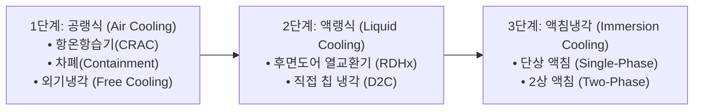
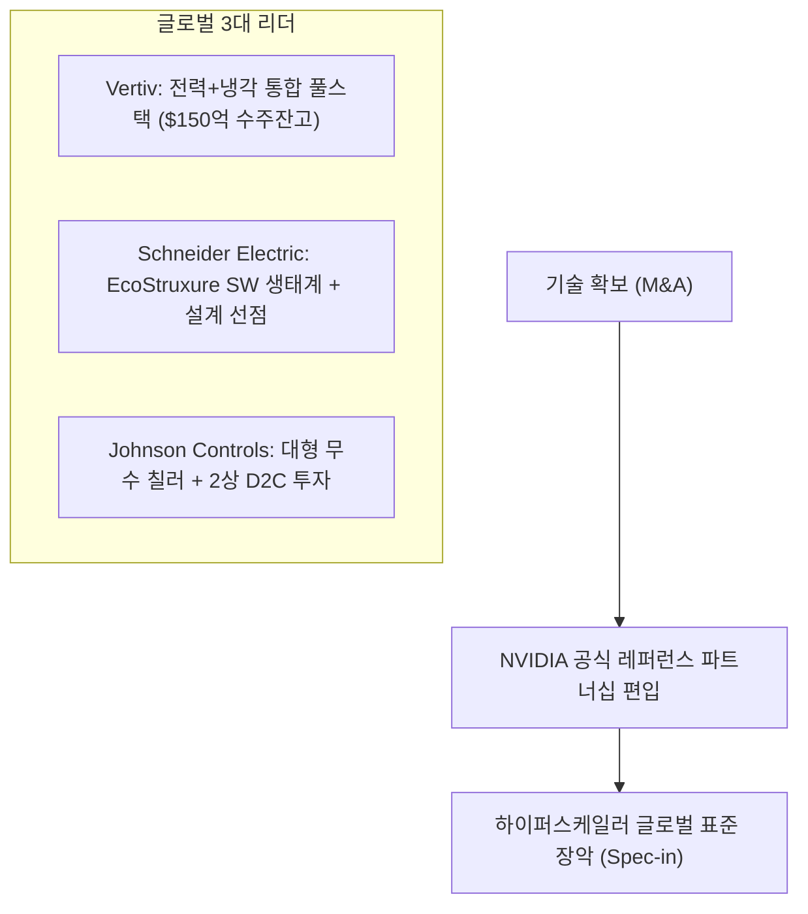

> **기반 보고서:** 삼일 PwC 경영연구원, *열을 잡는 자가 AI를 잡는다: AI 시대의 새로운 병목, 냉각 기술의 부상* (Industry Focus, 2026년 8월, 49페이지 전문)  
> **저자:** 이은영 상무, 최형원 연구원 / 감수: 최재영 삼일PwC 경영연구원장  
> **원문 다운로드:** [삼일 PwC 공식 PDF](https://www.pwc.com/kr/ko/insights/industry-focus/samilpwc_k-cooling-industry.pdf)  
> **글로벌 참고 출처:** IEA (*Energy and AI*, 2025/2026), McKinsey (*Keeping cool in the data age*, 2025.09), EU EED(Energy Efficiency Directive 2023/1791), Google DeepMind, Grand View Research, MarketsandMarkets, Fortune Business Insights, JLL Research, Dell'Oro Group  
> ⚠️ *본 포스팅은 삼일 PwC의 심층 산업 분석 리포트를 바탕으로 글로벌 에너지·인프라 리서치 및 열역학 공학 해설을 결합하여 작성한 분석 아티클입니다.*

---


OpenAI의 Sam Altman은 최근 *"GPUs are melting"*이라며 AI 인프라 확장의 가장 큰 물리적 장벽으로 전력과 발열을 지목했습니다. 이는 단순한 과장이 아닙니다.

삼일 PwC 경영연구원이 발간한 49페이지 분량의 심층 보고서 ***「열을 잡는 자가 AI를 잡는다: AI 시대의 새로운 병목, 냉각 기술의 부상」***과 IEA, McKinsey 등 글로벌 연구기관들의 데이터는 하나의 거대한 패러다임 전환을 명확히 보여줍니다.

> **"AI 경쟁의 병목은 더 이상 GPU 칩 수급이나 알고리즘에 머물지 않는다. 동일한 전력과 공간에서 가속기를 얼마나 안정적으로 '식힐 수 있느냐'가 AI 비즈니스의 최종 성능과 ROI를 결정한다. 냉각은 이제 보조 설비가 아니라 AI 데이터센터 설계의 출발점이자 가장 강력한 레버리지 기술이다."**

---

## 1. Executive Summary & 핵심 테제

보고서 전체를 관통하는 논지는 다음 5개 축으로 압축됩니다.

```
[1. 수요 측 압력] 2024년 415 TWh → 2030년 945 TWh (연 15% 가속). 전력 증가는 곧 100% 발열 증가.
       ↓
[2. 밀도의 구조적 급등] 하이퍼스케일 랙 36 kW → 48.7 kW, 차세대 AI 랙 120 kW ~ 1 MW. 공랭 물리적 한계 봉착.
       ↓
[3. 제약이 냉각을 격상] 전력망 증설 5~10년 소요, 수자원/인허가 제약으로 美 640억 달러 프로젝트 지연.
       ↓
[4. 가치의 이동] 개별 하드웨어(칠러/공조기) → 통합 시스템(D2C/CDU/액침) → 운영 플랫폼(AI 자율제어 SW).
       ↓
[5. 표준 선점 경쟁] R&D 대신 'M&A + NVIDIA 레퍼런스 편입' 공식. 비냉각 거대기업(Eaton, Ecolab) 참전.
```

---

## 2. AI의 뜨거운 역설: 전력, 열, 그리고 물리적 한계

### 2.1 전력 소비 전망과 열역학적 등식
데이터센터에 인입되는 전기 에너지는 극소량의 광신호와 통신 전송을 제외하면 **열역학 제1법칙에 의해 사실상 100% 열로 변환**됩니다. 서버 내부의 트랜지스터 스위칭 손실과 배선 저항 손실이 고스란히 열로 방출되기 때문입니다. 즉, **IT 전력 부하 100 MW는 데이터센터에서 즉시 제거해야 할 열 100 MW와 정확히 같습니다.**

| 지표 | 수치 및 전망 | 출처 |
|---|---|---|
| **2024년 글로벌 DC 전력 소비** | 약 415 TWh (전 세계 전력 수요의 약 1.5%) | IEA (*Energy and AI*, 2025) |
| **2030년 글로벌 DC 전력 전망** | 약 945 ~ 950 TWh (일본 연간 총 전력 소비량 규모) | IEA (2025/2026) |
| **연평균 성장률(CAGR)** | 과거 연 12% ➡️ **2024~2030년 연 15%로 가속** (글로벌 전력 증가율의 4배 이상) | IEA |
| **AI 서버 기인 비중** | 2025~2030년 서버 전력 증가분의 **약 70%가 가속 서버(GPU/TPU)에 기인** | IEA |
| **빅4 하이퍼스케일러 CapEx** | 2025년 한 해 AI 인프라 투자액만 **$3,200억 ~ $4,100억** 돌파 | IDC, 삼일 PwC |

### 2.2 랙 전력 밀도의 수직 상승: 왜 공랭은 끝났는가?

보고서에서 가장 핵심적으로 강조하는 데이터는 **NVIDIA 플랫폼 세대별 랙 전력 밀도**의 변화입니다.

| 시대 | 플랫폼 아키텍처 | 랙당 전력 소비 | 체감 비유 | 적용 냉각 기술 |
|---|---|---|---|---|
| **2015년경** | 범용 클라우드 x86 서버 | **5 ~ 10 kW** | 에어컨 2~4대 상시 가동 | 전통 공랭식 (CRAC/CRAH 바닥급기) |
| **2020~2023년** | 초기 AI 도입 (A100/H100) | **20 ~ 40 kW** | 일반 가정 10~20세대 동시 사용 | 고효율 공랭 + RDHx(후면도어) |
| **2025년** | NVIDIA GB200 NVL72 | **120 kW** | 일반 가정 약 80세대 | 직접 칩 냉각 (D2C 단상 수랭) |
| **2025~2026년** | NVIDIA GB300 NVL72 | **120 ~ 140 kW** | 일반 가정 90~100세대 | D2C 수랭 + 고성능 CDU |
| **2027~2028년** | NVIDIA Vera Rubin Ultra (Kyber) | **600 kW ~ 1 MW** | **중소규모 공장 1개 동** | **2상 D2C / 단상·2상 액침냉각** |

```
💡 [공학 해설: 랙 600 kW를 공기로 식힐 수 없는 정량적 이유]
- 공기의 부피 열용량: 약 1.2 kJ/m³·K
- 물의 부피 열용량: 약 4,180 kJ/m³·K (공기 대비 약 3,500배)
- 랙 발열 600 kW를 입출구 온도차 12°C의 공기로 제거하려면, 필요 풍량은 약 41.7 m³/s (약 88,000 CFM)에 달합니다.
- 표준 랙 전면 면적(약 1.2 m²) 통과 풍속은 무려 35 m/s (시속 125 km, 태풍급)입니다.
- 팬 동력은 풍속의 3승(P ∝ v³)에 비례하므로 팬을 돌리는 전력이 서버 전력을 초과하게 되며, 소음과 진동으로 물리적 가동이 불가능합니다.
- 반면 물을 사용할 경우 10°C 온도차 기준 약 14.4 L/s (약 860 LPM)의 유량만으로 완벽히 냉각되며, 이는 일반 배관 설계 범위 안입니다.
```

### 2.3 평균 밀도와 AI 전용 밀도의 괴리 (인프라 이원화)
JLL Research에 따르면 데이터센터 평균 랙 밀도는 다음과 같이 분화되고 있습니다.
- **기업 및 코로케이션 데이터센터:** 2023년 12.8 kW ➡️ 2027년 17.3 kW (여전히 20 kW 미만 유지)
- **하이퍼스케일 데이터센터:** 2023년 36.1 kW ➡️ 2027년 48.7 kW
- **AI 전용 클러스터 홀:** **120 kW ~ 1 MW**

즉, 모든 서버 랙이 액체로 바뀌는 것이 아니라, **기존 범용 공랭 홀과 초고밀도 액랭/액침 홀이 한 사이트 안에서 공존**하게 됩니다. 이것이 RDHx(후면도어 열교환기) 레트로핏 시장과 하이브리드 냉각 시스템이 장기 공존하는 이유입니다.

### 2.4 인프라 제약과 '레버리지 기술'로서의 냉각
- **전력망 병목:** 송배전망 확충에는 5~10년이 걸리지만 AI DC 증설은 수개월~2년 단위로 전력을 요구합니다.
- **부지 및 수자원 제약:** McKinsey(2025.09)에 따르면 미국 데이터센터의 약 40%가 고수자원 스트레스(Water-stressed) 지역에 위치하며, 최근 2년간 **640억 달러(약 88조 원) 규모의 프로젝트가 전력·수자원·인허가 이슈로 지연/취소**되었습니다.
- **PUE 개선 = 신규 발전소 없는 용량 확보:**
  - PUE 1.5 사이트: IT 장비 100 MW 구동 시 총 150 MW 소비 (50 MW 냉각·전력 손실)
  - PUE 1.2 사이트: IT 장비 100 MW 구동 시 총 120 MW 소비 (20 MW 냉각 손실)
  - **차이 30 MW = 연간 262,800 MWh = 산업용 전력 기준 연간 수백억 원 절감 + 추가 GPU 30 MW분 투입 가능**

---

## 3. 냉각 기술의 3단계 진화와 방식별 상세 비교

보고서는 냉각 기술의 발전 방향을 공간 전체(Room) ➡️ 랙 열(Row) ➡️ 칩(Chip) 바로 곁으로 열원과의 거리를 좁히는 **'초밀착(Ultra-Proximity)'**으로 정의합니다.



### 3.1 냉각 방식별 핵심 지표 비교 (XDNODE & McKinsey 종합)

| 냉각 방식 | PUE 범위 | 적합 랙 밀도 | 전력 배분 구조 (IT / 냉각 / 기타) | 주요 장점 | 주요 단점 및 과제 |
|---|---|---|---|---|---|
| **공랭식 (Air)** | 1.4 ~ 1.7 | ~ 10 kW | IT 45% / **냉각 40%** / 기타 15% | 검증된 기술, 낮은 초기 CAPEX, 유지보수 용이 | 낮은 열효율, 초고밀도 대응 불가, 높은 팬 전력 |
| **액랭식 (D2C)** | 1.15 ~ 1.3 | 20 ~ 50 kW (단상)<br>50 ~ 100 kW (2상) | IT 65% / **냉각 13%** / 기타 22% | 뛰어난 냉각 효율, 기존 랙 폼팩터 유지, 시장 주류 | 배관 복잡성, 누수(Leakage) 리스크, CDU 필수 |
| **액침냉각 (Immersion)** | **1.05 ~ 1.15** | **50 kW ~ 100 kW+** | **IT 72%** / **냉각 4%** / 기타 24% | 이론상 최고 효율, 무팬·무소음, 부품 균일 냉각 | 높은 초기 CAPEX, 전용 유체(냉각유) 필요, 유지보수 절차 상이 |

### 3.2 핵심 컴포넌트: CDU(Coolant Distribution Unit)가 왜 필수인가?
직접 액랭(D2C) 및 액침 시스템에서 **CDU**는 단순한 펌프 장치가 아닙니다.
1. **루프 격리:** 시설측 1차 루프(FWS, 냉각탑/칠러)와 랙 내부 2차 루프(TCS, 콜드플레이트)를 열교환기로 분리하여 수질 오염 및 미생물 번식을 차단합니다.
2. **압력 제어:** 랙 내부 순환 압력을 최저로 유지해 누수 시 피해를 최소화합니다.
3. **결로 방지:** 공급 수온을 데이터센터 실내 이슬점(Dew Point) 이상으로 정밀 제어하여 전자 부품 결로를 원천 차단합니다.

### 3.3 단상 vs 2상 메커니즘 차이
- **단상 D2C / 액침:** 유체가 순환하면서 현열(Sensible Heat)로 열을 흡수. 상태 변화 없음.
- **2상 D2C / 액침:** 끓는점이 낮은(50~60°C) 특수 불소계/합성 냉매가 기화하면서 **기화잠열(Latent Heat, kg당 80~100 kJ)**을 흡수. 단상 대비 2배 이상의 열전달 효율과 부품 전체의 완벽한 등온성(Isothermal)을 제공하지만, 냉매 회수 및 규제(PFAS) 관리가 핵심 과제입니다.

---

## 4. 냉각 산업의 6대 변화와 비즈니스 기회

삼일 PwC는 냉각 시장을 바꾸는 6가지 축을 **기술 혁신 3가지**와 **사업 모델 혁신 3가지**로 구분합니다.

```
┌─────────────────────────────────────────────────────────────┐
│                    냉각 산업의 6대 변화                       │
├──────────────────────────────┬──────────────────────────────┤
│      A. 기술 혁신 (Tech)       │     B. 사업 모델 혁신 (Biz)     │
├──────────────────────────────┼──────────────────────────────┤
│ 1. 랙 밀도 급등과 인프라 대응   │ 4. 폐열의 자원화 (Heat Reuse) │
│ 2. 액침냉각의 글로벌 표준화    │ 5. 모듈러 데이터센터 확산     │
│ 3. AI 기반 자율 냉각 (Dynamic)│ 6. 엣지 데이터센터의 부상     │
└──────────────────────────────┴──────────────────────────────┘
```

### 1️⃣ 랙 밀도 급등 (Density Surge)
- 10 kW ➡️ 140 kW ➡️ 1 MW로 이어지는 로드맵에 맞춰 공랭에서 D2C, 액침으로의 단계적 전환 가속.

### 2️⃣ 액침냉각의 표준화와 NVIDIA 변수
- **Alibaba 실증:** 단상 액침 대규모 적용으로 PUE 1.05~1.07, 총 전력 36% 절감 실적 달성.
- **NVIDIA의 스탠스 전환:** 기존에는 D2C 위주였으나, 2027~2028년 출시될 **Rubin Ultra(Kyber 랙, 600kW~1MW)**를 위해 공식 액침 파트너 물색 개시. NVIDIA 레퍼런스 아키텍처 편입 여부가 업계 표준을 결정할 전망.

### 3️⃣ AI 기반 자율 냉각 (Dynamic Operation)
- **Google DeepMind:** 5분 주기, 수천 개 센서 데이터를 머신러닝으로 분석해 칠러·팬 셋포인트를 실시간 제어. **냉각 전력 40% 절감, 연간 40,000톤 탄소 감축**.
- 최악 조건 기준으로 24시간 풀가동하던 보수적 정압 제어에서 워크로드 기반의 '가변속 동적 운영'으로 패러다임 전환.

### 4️⃣ 폐열의 자원화: "버리는 열에서 파는 열로"
- 액체 냉각은 배출 수온이 45~60°C로 높아 히트펌프를 통한 열회수 효율(COP)이 매우 높습니다.
- **Meta 오덴세 (덴마크):** 서버 폐열을 70~75°C로 승온해 연간 165,000 MWh 공급 (11,000가구 난방).
- **Google 하미나 (핀란드):** 85°C 온수를 지역난방망에 무상 공급 (시 전체 수요의 80% 충당).
- **EU 규제 (EED 2023/1791 & 독일 EnEfG):** 2027년부터 500 kW 이상 DC의 PUE, WUE, 폐열회수율(ERF) 공시 의무화. 독일은 신규 DC에 **폐열 15% 재활용 의무화**. 폐열 공급 능력이 곧 **'데이터센터를 지을 권리(License to Build)'**로 격상.

### 5️⃣ 모듈러 데이터센터 (Prefab Modular DC)
- AI 모델 세대교체 주기(18개월)와 전통적 DC 구축 기간(24~30개월) 간의 미스매치를 해결.
- **구축 기간:** 30개월 ➡️ **12개월 (60% 단축)**
- **비용 (2 MW 기준):** $1,400만 ➡️ **$800만 (43% 절감)**
- **PUE 개선:** 공장 사전 조립 및 테스트로 현장 시공 대비 약 15% 향상.

### 6️⃣ 엣지 데이터센터 (Edge DC)
- 자율주행(100 km/h 주행 시 0.1초 지연은 3m 이동) 및 실시간 AI 추론 확산.
- 도심지·병원·물류센터 등 사용자 근접 지역에 설치되므로 **무소음·무수(Waterless) 냉각 필수 ➡️ 액침냉각 및 고효율 무수 칠러의 핵심 적용처**.

---

## 5. 글로벌 경쟁 지형: M&A와 표준 선점의 2단계 공식

글로벌 냉각 시장은 **"R&D로 개발할 시간이 없다. M&A로 기술을 사고, NVIDIA 레퍼런스에 편입되어 표준을 장악한다"**는 2단계 공식으로 움직이고 있습니다.



### 5.1 글로벌 3대 리더 비교 분석

| 구분 | Vertiv (버티브) | Schneider Electric (슈나이더) | Johnson Controls (존슨콘트롤즈) |
|---|---|---|---|
| **핵심 경쟁력** | 전력 + 냉각 일체형 포트폴리오, 엔지니어링 실행력 | 소프트웨어(EcoStruxure) 기반 고객 락인, 설계 단계 선점 | YORK 대형 칠러, 무수(Waterless) 냉각, 2상 기술 선제 투자 |
| **NVIDIA 협력** | GB200 NVL72용 **7 MW 레퍼런스 아키텍처 공동 개발**, 800VDC 공동 선언 | GB200 승인 공급사, 레퍼런스 설계 공동 개발 | 칠러 및 CDU 공급 파트너십 |
| **핵심 M&A** | CoolTera (CDU, 2023), PurgeRite ($10억, 2025), STL (콜드플레이트, 2026) | Motivair (액체냉각 75% 지분 인수, 2025) | Silent-Aire 인수, Accelsius (2상 D2C 투자), Alloy Enterprises (2026) |
| **차별화 포인트** | 구축 일정 50% 단축 역량, $150억 수주잔고 | 설계 SW 툴 선점으로 하드웨어 자동 연계(Spec-in) | 순수 DC 열관리 기업으로 사업 재편, 폐열 재활용 칠러 |

### 5.2 이종 거대 기업들의 조 단위 참전 (총력전)
1. **Eaton (전력 관리 1위) ➡️ Boyd Thermal 인수 ($95억 / 약 13조 원, 2026.03):**  
   전력 수배전반 1위 기업이 냉각 부품사를 인수하여 '그리드에서 칩까지(Grid-to-Chip)' 통합 솔루션으로 Vertiv에 정면 승부.
2. **Ecolab (산업용 수처리 1위) ➡️ CoolIT Systems 인수 ($47.5억 / 약 6.5조 원, 2026.07):**  
   전 세계 1,000개 이상 데이터센터에 수처리 서비스를 제공하던 인프라에 D2C 액체냉각 하드웨어를 결합하여 유체 생애주기 관리 시장 독점 시도.

---

## 6. K-냉각(한국 기업)의 현주소와 생존 해법: Niche-to-Alliance

삼일 PwC는 한국 기업들이 윤활유, 가전 공조, 반도체 클린룸 등 **기존 인접 산업의 막강한 자산을 빠르게 재배치**하고 있어 진입 타이밍은 매우 훌륭하다고 진단합니다.

### 6.1 밸류체인별 국내 주요 기업 현황

```
[Upstream: 냉각유/소재]
• SK엔무브: 국내 1호 액침 상용화 (SKT DC), 美 GRC 지분 투자로 글로벌 인증 체계 선점
• GS칼텍스: Kixx Immersion Fluid 출시, NSF 식품등급 인증으로 안전성 차별화
• S-Oil / HD현대오일뱅크: 고인화점(250°C 이상) 액침유 개발 및 GRC 인증 확보

[Midstream: 시스템/칠러]
• LG전자: 가전 HVAC 코어테크(무급유 터보 칠러) 기반 대형 클라우드 공급, SK엔무브-GRC와 삼각 동맹
• 삼성전자: 유럽 최대 공조기업 Fläkt Group M&A로 공조 내재화, 스타게이트 연합 참여
• GST: 반도체 칠러 노하우로 단상/2상 액침 독자 개발, LG유플러스 DC에 국내 1호 납품

[Downstream: 시공/EPC]
• 케이엔솔: 글로벌 1위 Submer와 독점 파트너십, 국내 DC 액침 시공 주도
• 신성이엔지: 반도체 클린룸 기술 기반 Fan Wall Unit(FWU) 및 모듈러 데이터센터 올인원(AIO) 제품화
```

### 6.2 K-냉각 경쟁력 SWOT 분석
- **강점(S):** 정유·가전·반도체·배터리 클린룸 등 세계 최고 수준의 인접 제조 자산 보유.
- **약점(W):** 통합 시스템 엔지니어링 및 텔레메트리 운영 소프트웨어 역량 부족 (단품 납품 위주).
- **기회(O):** 글로벌 액체냉각 본격 개화(2026~2027년) 및 모듈러 DC 시장 확대.
- **위협(T):** NVIDIA, OCP 등 글로벌 표준 진영 진입 실패 시 하청 단품 공급사로 전락 위험.

### 6.3 3대 정책 제언 및 기업 전략: "Niche-to-Alliance"
1. **소방법 인화점(250°C) 규제 완화 & 국가 인증센터 설립 (정부 최우선 과제):**  
   열전달 효율을 높이려면 유체의 분자량을 낮춰야 하는데, 국내 소방법은 250°C 이상만 비위험물로 분류하여 고효율 저점도 액침유와 2상 냉매의 도입을 가로막고 있습니다. 안전을 확보한 별도 인증 트랙이 시급합니다.
2. **Niche-to-Alliance 전략 (기업 과제):**  
   모든 라인업을 자체 개발하기보다, 틈새 전문 기술(고인화점 냉각유, 2상 콜드플레이트, 모듈 시공)을 무기로 글로벌 톱티어(NVIDIA, Vertiv, Submer, GRC)와 동맹을 맺고 표준 생태계에 편입되어야 합니다.
3. **단품 하드웨어에서 '소프트웨어 데이터 자산화'로:**  
   BMS 텔레메트리 데이터를 수집하고 AI 최적화 알고리즘을 얹어 운영 단계의 락인(Lock-in) 가치를 확보해야 합니다.

---

## 7. 글로벌 데이터센터 냉각 시장 전망 종합

| 세부 시장 | 2025~2026년 규모 | 장기 전망치 | CAGR | 주요 성장 동인 |
|---|---|---|---|---|
| **글로벌 DC 냉각 전체** | 약 $188억 ~ $210억 | 2034년 **$544억** (약 75조 원) | **12.6% ~ 13.0%** | AI 가속 서버 전력 증가, PUE 규제 |
| **액체 냉각 (D2C + 액침)** | 약 $40억 ~ $82억 | 2033년 **$276억 ~ $295억** | **20.1% ~ 31.5%** | 랙당 40 kW 초과 AI 클러스터 표준화 |
| **액침냉각 (Immersion)** | 약 $5.7억 ~ $42억 | 2032년 **$26.1억 ~ $230억** | **14.0% ~ 25.0%** | 차세대 초고밀도 랙 (100 kW ~ 1 MW) |
| **모듈러 데이터센터** | 약 $350억 ~ $420억 | 2030년 **$800억+** | **17.4% ~ 22.4%** | DC 구축 기간 60% 단축, 사전 검증 |
| **엣지 데이터센터** | 약 $150억 ~ $180억 | 2035년 **$720억+** | **17.5% ~ 22.8%** | AI 실시간 인퍼런스, 자율주행, 무수 냉각 |

*출처: 삼일 PwC, Fortune Business Insights, MarketsandMarkets, Grand View Research, Global Market Insights 종합*

---

## 8. DCEO / 인프라 엔지니어 관점의 실무 체크포인트

삼일 PwC 리포트가 시장과 투자자 관점에서 기술의 당위성을 설파했다면, 실제 데이터센터를 설계하고 운영하는 DCEO(Data Center Engineering Operations) 조직은 다음의 **물리적 리스크**를 반드시 사전에 검토해야 합니다.

1. **하이브리드 홀(Hybrid Hall) 기류 및 배관 관리:**  
   기존 15 kW급 공랭 랙과 120 kW급 D2C 랙이 동일 데이터 홀에 공존할 때 발생하는 국소 열섬 현상과 CDU 배관의 압력 강하 밸런싱.
2. **누수(Leakage) 및 결로(Condensation) EOP 수립:**  
   CDU를 경계로 한 누수 감지 센서 3중화, 랙 단위 퀵 디스커넥트(QD) 차단 절차, 이슬점 추종 수온 제어 루프 검증.
3. **유체 열화(Fluid Degradation) 및 화학적 양립성(Compatibility):**  
   액침냉각 시 절연유가 서버 PCB의 실링재, 케이블 피복, 라벨 접착제와 반응해 용출물이 발생하는지 장기 검증.
4. **유지보수(MCM) 절차의 전환:**  
   서버 장애 시 크레인 호이스트를 이용한 침전 서버 인출, 세척 및 드레인 절차, 벤더 워런티 보증 범위 사전 정의.

---

## 9. 맺음말: 열역학이 AI의 한계를 결정한다

> **"AI 산업의 미래는 반도체가 아니라 전력과 열에서 결정될 것이다. 열을 잡는 자가 AI를 잡는다."**  
> — 삼일 PwC 경영연구원 (2026.08)

알고리즘의 진화와 HBM의 집적도가 아무리 눈부셔도, 발생한 열을 대기 중이나 유체로 안전하게 방출하지 못하면 반도체는 단 1초도 제 성능을 낼 수 없습니다. 

데이터센터 냉각은 이제 기계실 구석의 보조 인프라가 아니라, **AI 패권을 쥐기 위한 가장 거대한 물리적 전장이자 핵심 레버리지 엔진**입니다.

---

### 📚 공식 출처 및 추가 읽을거리
- 📄 **[삼일 PwC 원문 리포트 PDF 다운로드]** [열을 잡는 자가 AI를 잡는다: AI 시대의 새로운 병목, 냉각 기술의 부상](https://www.pwc.com/kr/ko/insights/industry-focus/samilpwc_k-cooling-industry.pdf)
- 🌐 **[IEA 공식 보고서]** [Energy and AI: Energy demand from AI and data centres](https://www.iea.org)
- 🌐 **[McKinsey & Company]** [Keeping cool in the data age: Water and energy challenges](https://www.mckinsey.com)
- 🌐 **[Google DeepMind]** [Safety-first AI for data centre cooling efficiency](https://deepmind.google)
- 🌐 **[Meta Sustainability]** [District Heating from Meta's Odense Data Centre](https://sustainability.atmeta.com)
- 🌐 **[EU EED 지침]** [European Energy Efficiency Directive 2023/1791 Information Portal](https://energy.ec.europa.eu)

---

*본 분석 아티클은 삼일 PwC 경영연구원의 공개 리포트를 기반으로 최신 글로벌 데이터센터 리서치 및 DCEO 엔지니어링 해설을 더해 작성되었습니다. 인용된 모든 정량 데이터와 기업 분석의 원 저작권은 각 원문 발행 기관에 있습니다.*
